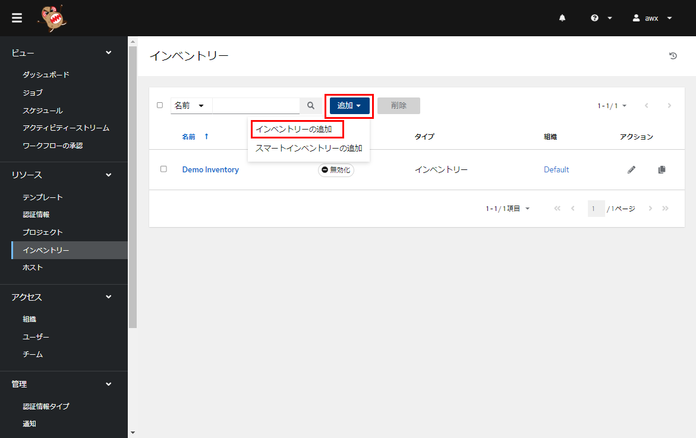
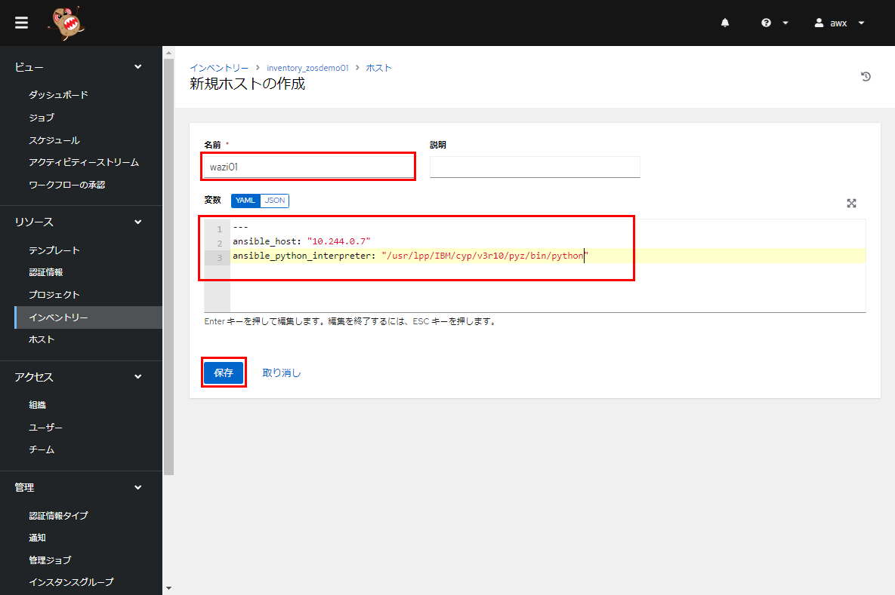

# ISEConf2023_MySampleAnsible01

## 概要

Ansible/AWXを使用してz/OS上にデータセットを作成するデモ用のリポジトリです。

シンプルなPlaybookとそこで使用しているJCLのテンプレート等が含まれます。

- Playbook
    - alloc_dataset.yml: データセットをDEL/DEFするJCLを実行するための操作を記述したもの(内容は後述)

- JCLテンプレート
    - alloc_template.jcl: データセットDEL/DEFのためのJCLテンプレート(Ansibleで使われるJinja2というテンプレートの仕組みを使って記述しています)

- 環境変数ファイル
    - host_vars以下に対象のホスト(z/OS)ごとの環境変数を設定したファイルを配置しています。ここで環境ごとに異なる情報をセットしています。

- Collection
    - ここに含まれるPlaybookでは、IBM z/OS Core Collection(z/OS用の基本操作を行うためのモジュールを提供するもの)を使用しています。必要なCollectionの情報を`collections\requirements.yml`ファイルに指定しています。

このPlaybookは、wazi01, zdt01というホストに対して実行することを想定しています。wazi01, zdt01それぞれに対してDUMMYのデータセットをDEL/DEFするJCLを実行します。
対象ホストごとの環境変数で、作成されるデータセットの名前やVOLSERを制御しています。

### Playbookの内容

alloc_dataset.ymlというPlaybookでは以下の操作(task)を行っています。

(1) envvars <br/>
環境変数設定確認します。

(2) render and copy template <br/>
Jinja2テンプレートとして作成されているtemplate\alloc_template.jclを対象ホストにコピー(この時変数の置換などが行われる)します。コピー先はUSS上の`~/temp/alloc_test.jcl`です。(ここではコード変換が行われないのでUTF-8のままとなっています)

(3) Detect character set for locale on target <br/>
対象ホストのlocaleを確認するコマンドを実行し、結果を変数(`locale_result`)に格納します。

(4) display locale <br/>
確認用に(3)の結果を表示します。

(5) Set variable target_charset with target charset <br/>
変数 `target_charset`に対象ホストの文字コード(EBCDIC)をセットします。

(6) display target_charset<br/>
確認のためセットした変数 `target_charset`の内容を表示します。

(7) Encode JCL from UTF-8 to target_charset <br/>
先に作成されたUSS上のJCL`~/temp/alloc_test.jcl`をEBCDICにコード変換して`~/temp/alloc_test_encoded.jcl`を作成します。<br/>
※IBM z/OS Core Collectionの`ibm.ibm_zos_core.zos_encode`を使用

(8) display encode result <br/>
確認用にコード変換の結果を表示します。

(9) submit JCL <br/>
JCL `~/temp/alloc_test_encoded.jcl` をサブミットします。<br/>
※IBM z/OS Core Collectionの`ibm.ibm_zos_core.zos_job_submit`を使用

(10) display results <br/>
確認用にJCLサブミット結果を表示します。


### JCLテンプレート(Jinja2)補足

```jcl:alloc_template.jcl
//ALLOC JOB CLASS=A,MSGCLASS=X,MSGLEVEL=(1,1)
//*********************************************************************
//DELETE   EXEC PGM=IDCAMS,REGION=1M                        @P4C
//SYSPRINT DD SYSOUT=*
//SYSIN    DD *
         DELETE {{ datasetName }} NONVSAM
         SET MAXCC=0
//*
//ALLOC    EXEC PGM=IEFBR14
//DUMMY    DD SPACE=(TRK,(10,1,1)),
//            UNIT=3390,
//*
//            VOL=SER={{ volser }},

//*
//            STORCLAS={{ storageClass }},

//            DISP=(NEW,CATLG),
//            DSNTYPE=LIBRARY,
//            RECFM=FB,
//            LRECL=80,
//            BLKSIZE=32720,
//            DSN={{ datasetName }}
//*
```

上のようなJCLの雛形を作成しています。`{{ xxx }}` や `` という記述がJinja2の作法に従った記述で、環境変数の値などを元に文字列の置き換えなどが行われます。このテンプレートでは、以下の環境変数でDEL/DEFするデータセットを制御しています。

- datasetName: DEL/DEFしたいデータセットの名前
- useVolser: {True|False} VOLSERを明示指定するかどうか
- volser: VOLSER名 (明示指定したい場合)
- useStorageClass: {True|False} StorageClassを明示指定するかどうか
- storageClass: StorageClass名 (明示指定したい場合)


## 使用例

AWXを使用して上のPlaybookを流す例を示します。

### 前提

対象となるz/OS (上の想定ではwazi01, zdt01)環境は、以下のセットアップがされていることが前提です。

- ZOAU(IBM Z Open Automation Utility)のセットアップ
- Python for z/OSのセットアップ
- SSHサーバーのセットアップ

また、AWXサーバーからSSH経由で鍵認証による接続ができる設定をしておき、かつSSHユーザーのUSS上のホームディレクトリに`temp`ディレクトリを作成しておく必要があります。<br/>
この例では、各z/OSにANSIBL1というユーザーを作成し、同一のPrivateKeyでSSHできる設定をしている前提とします。ホームディレクトリ下にtempディレクトリ (`/u/ANSIBL1/temp`)を作成しておきます。

### AWX構成

#### インベントリー/ホスト追加
ここでは、"inventory_zosdemo01"というインベントリーを作成します。

AWXのコンソールからインベントリーを選択し、追加-インベントリーの追加を選択


名前を指定して保存


インベントリーにホストを追加してきます。<br/>
ホストタブを選択して追加


wazi01というホストを追加します。ここで、対象ホストの宛先や、pythonのパスなど必要に応じて設定します。


同様に、zdt01というホストを追加します。ここではSSHのポートがデフォルトの22ではなく別のポート番号を使用している想定なのでポート番号の指定も行っています。


#### 認証情報追加
ここでは、操作対象のホストに対する認証情報(SSH接続要)と、GitHubアクセス用(当リポジトリアクセス用)の認証情報を登録します。

##### ホストアクセス用
認証情報から追加をクリック


認証情報タイプとして"マシン"を選択し、その他適宜必要な情報を設定します。


##### GitHubアクセス用
同様にGitHubアクセス用の認証情報も追加します。<br/>
※この例ではパスワードにはGitHubで生成したアクセストークンを指定


#### プロジェクト作成
"ISEConf2023_MySampleAnsible01"というプロジェクトを作成します。ここでPlaybookを含む当GitHubのリポジトリとの紐づけを行います。

プロジェクトから追加をクリック


ソース・コントロールのタイプからGitを選択し、適宜値を設定します。<br/>
ソースコントロールのURLにはPlaybookが含まれるGitHubリポジトリ(当リポジトリの想定)を指定します。ソースコントロールの認証情報には、上で追加したGitHubアクセス用の認証情報を指定します。


プロジェクトを作成すると指定したGitHubリポジトリとの同期がとられ、クローンが完了するとステータスが"成功"となります。


#### テンプレート作成
AWX上のテンプレートというのは、Playbookとインベントリーを紐づけてAnsibleジョブを実行するためのパラメーターのセットを指します。<br/>
(Playbookの中で使用したJinja2テンプレートとは別物ですのでご注意ください。用語が紛らわしい...)

テンプレートから追加-新規ジョブテンプレートの追加を選択


インベントリーには上で作成した"inventory_zosdemo01"を指定<br/>
プロジェクトには上で作成した"ISEConf2023_MySampleAnsible01"を指定<br/>
Playbookには、プルダウンメニューから実行したいYAMLファイル "allocate_dataset.yml"を指定<br/>
認証情報には、上で作成したホストアクセス用の認証情報"ANSIBL1"を指定<br/>


### Playbook実行
AWX上の構成が一通り済んだので、Playbookを実行してみます。<br/>
上で作成したテンプレートを開いて"起動"をクリック


ジョブの結果を確認


<details><summary><font color="blue">参考: 出力結果</font></summary><div>

```
Identity added: /runner/artifacts/40/ssh_key_data (gmx\\a00527jp6@IBM-PF3ALW3Q)
[WARNING]: Collection ibm.ibm_zos_core does not support Ansible version 2.14.4

PLAY [submit a zos command] ****************************************************

TASK [envvars] *****************************************************************
ok: [wazi01] => {
    "msg": "environemt_variables are {'LIBPATH': '/lib:/usr/lib', '_BPXK_AUTOCVT': 'ALL'}"
}
ok: [zdt01] => {
    "msg": "environemt_variables are {'LIBPATH': '/lib:/usr/lib:/usr/lpp/IBM/zoautil/lib', '_BPXK_AUTOCVT': 'ALL'}"
}

TASK [render and copy template] ************************************************
ok: [wazi01]
ok: [zdt01]

TASK [Detect character set for locale on target wazi01] ************************
changed: [wazi01]
changed: [zdt01]

TASK [display locale] **********************************************************
ok: [wazi01] => {
    "msg": "locale_result: {'changed': True, 'stdout': 'IBM-1047', 'stderr': '', 'rc': 0, 'cmd': ['locale', '-c', 'charmap'], 'start': '2023-04-19 01:13:20.954070', 'end': '2023-04-19 01:13:21.162159', 'delta': '0:00:00.208089', 'msg': '', 'stdout_lines': ['IBM-1047'], 'stderr_lines': [], 'failed': False} / codepage: IBM-1047"
}
ok: [zdt01] => {
    "msg": "locale_result: {'changed': True, 'stdout': 'IBM-1047', 'stderr': '', 'rc': 0, 'cmd': ['locale', '-c', 'charmap'], 'start': '2023-04-19 05:13:27.648196', 'end': '2023-04-19 05:13:28.390995', 'delta': '0:00:00.742799', 'msg': '', 'stdout_lines': ['IBM-1047'], 'stderr_lines': [], 'failed': False} / codepage: IBM-1047"
}

TASK [Set variable `target_charset` with target wazi01 charset] ****************
ok: [wazi01]
ok: [zdt01]

TASK [display target_charset] **************************************************
ok: [wazi01] => {
    "msg": "IBM-1047"
}
ok: [zdt01] => {
    "msg": "IBM-1047"
}

TASK [Encode script from UTF-8 to target_charset] ******************************
changed: [wazi01]
changed: [zdt01]

TASK [display encode result] ***************************************************
ok: [wazi01] => {
    "msg": {
        "backup_name": null,
        "changed": true,
        "dest": "/u/ANSIBL1/temp/alloc_test_encoded.jcl",
        "failed": false,
        "gid": 0,
        "group": "SYS1",
        "mode": "0644",
        "owner": "ANSIBL1",
        "size": 624,
        "src": "/u/ANSIBL1/temp/alloc_test.jcl",
        "state": "file",
        "uid": 100106
    }
}
ok: [zdt01] => {
    "msg": {
        "backup_name": null,
        "changed": true,
        "dest": "/u/ANSIBL1/temp/alloc_test_encoded.jcl",
        "failed": false,
        "gid": 0,
        "group": "SYS1",
        "mode": "0644",
        "owner": "ANSIBL1",
        "size": 554,
        "src": "/u/ANSIBL1/temp/alloc_test.jcl",
        "state": "file",
        "uid": 100109
    }
}

TASK [submit JCL] **************************************************************
ok: [wazi01]
ok: [zdt01]

TASK [display results] *********************************************************
ok: [wazi01] => {
    "msg": "Result: {'changed': False, 'job_id': 'JOB00388', 'jobs': [{'job_id': 'JOB00388', 'job_name': 'ALLOC', 'subsystem': 'VS01', 'system': '', 'owner': 'ANSIBL1', 'ret_code': {'msg': 'CC 0000', 'code': 0, 'msg_code': '0000', 'msg_txt': '', 'steps': [{'step_name': 'DELETE', 'step_cc': '0000'}, {'step_name': 'ALLOC', 'step_cc': '0000'}, {'step_name': 'DELETE', 'step_cc': '0000'}, {'step_name': 'ALLOC', 'step_cc': '0000'}, {'step_name': 'DELETE', 'step_cc': '0000'}, {'step_name': 'ALLOC', 'step_cc': '0000'}, {'step_name': 'DELETE', 'step_cc': '0000'}, {'step_name': 'ALLOC', 'step_cc': '0000'}]}, 'class': 'A', 'content_type': 'JOB', 'ddnames': [{'ddname': 'JESMSGLG', 'record_count': '16', 'id': '2', 'stepname': 'JES2', 'procstep': '', 'byte_count': '658', 'content': ['1                         J E S 2  J O B  L O G  --  S Y S T E M  V S 0 1  --  N O D E  N 1              ', '0 ', ' 14.13.41 JOB00388 ---- WEDNESDAY, 19 APR 2023 ----', ' 14.13.41 JOB00388  IRR010I  USERID ANSIBL1  IS ASSIGNED TO THIS JOB.', ' 14.13.41 JOB00388  ICH70001I ANSIBL1  LAST ACCESS AT 14:13:02 ON WEDNESDAY, APRIL 19, 2023', ' 14.13.41 JOB00388  $HASP373 ALLOC    STARTED - INIT 1    - CLASS A        - SYS VS01', ' 14.13.41 JOB00388  IEF403I ALLOC - STARTED - TIME=14.13.41', ' 14.13.41 JOB00388  IEF404I ALLOC - ENDED - TIME=14.13.41', ' 14.13.41 JOB00388  $HASP395 ALLOC    ENDED - RC=0000', '0------ JES2 JOB STATISTICS ------', '-  19 APR 2023 JOB EXECUTION DATE', '-           22 CARDS READ', '-           83 SYSOUT PRINT RECORDS', '-            0 SYSOUT PUNCH RECORDS', '-            9 SYSOUT SPOOL KBYTES', '-         0.00 MINUTES EXECUTION TIME', '         1 //ALLOC JOB CLASS=A,MSGCLASS=X,MSGLEVEL=(1,1)                           JOB00388', '           //*********************************************************************         ', '         2 //DELETE   EXEC PGM=IDCAMS,REGION=1M                        @P4C                ', '         3 //SYSPRINT DD SYSOUT=*                                                          ', '         4 //SYSIN    DD *                                                                 ', '           //*                                                                             ', '         5 //ALLOC    EXEC PGM=IEFBR14                                                     ', '         6 //DUMMY    DD SPACE=(TRK,(10,1,1)),                                             ', '           //            UNIT=3390,                                                        ', '           //*                                                                             ', '           //            VOL=SER=TEMP01,                                                   ', '           //*                                                                             ', '           //            STORCLAS=SCNOSMS,                                                 ', '           //            DISP=(NEW,CATLG),                                                 ', '           //            DSNTYPE=LIBRARY,                                                  ', '           //            RECFM=FB,                                                         ', '           //            LRECL=80,                                                         ', '           //            BLKSIZE=32720,                                                    ', '           //            DSN=ANSIBL1.DUMMY01                                               ', '           //*                                                                             ', ' ICH70001I ANSIBL1  LAST ACCESS AT 14:13:02 ON WEDNESDAY, APRIL 19, 2023', ' IEFA111I ALLOC IS USING THE FOLLOWING JOB RELATED SETTINGS:', '          SWA=BELOW,TIOT SIZE=64K,DSENQSHR=DISALLOW,GDGBIAS=JOB', ' IEF236I ALLOC. FOR ALLOC DELETE', ' IEF237I JES2 ALLOCATED TO SYSPRINT', ' IEF237I JES2 ALLOCATED TO SYSIN', ' IEF237I DE02 ALLOCATED TO SYS00001', ' IEF285I   ANSIBL1.DUMMY01                              KEPT          ', ' IEF285I   VOL SER NOS= TEMP01.                            ', ' IEF142I ALLOC DELETE - STEP WAS EXECUTED - COND CODE 0000', ' IEF285I   ANSIBL1.ALLOC.JOB00388.D0000102.?            SYSOUT        ', ' IEF285I   ANSIBL1.ALLOC.JOB00388.D0000101.?            SYSIN         ', ' IEF373I STEP/DELETE  /START 2023109.1413', ' IEF032I STEP/DELETE  /STOP  2023109.1413 ', '         CPU:     0 HR  00 MIN  00.00 SEC    SRB:     0 HR  00 MIN  00.00 SEC    ', '         VIRT:    84K  SYS:   332K  EXT:        8K  SYS:    10300K', '         ATB- REAL:                    20K  SLOTS:                     0K', '              VIRT- ALLOC:      10M SHRD:       0M', ' IEF236I ALLOC. FOR ALLOC ALLOC', ' IGD100I DE02 ALLOCATED TO DDNAME DUMMY    DATACLAS (        )', ' IEF142I ALLOC ALLOC - STEP WAS EXECUTED - COND CODE 0000', ' IEF285I   ANSIBL1.DUMMY01                              CATALOGED     ', ' IEF285I   VOL SER NOS= TEMP01.                            ', ' IEF373I STEP/ALLOC   /START 2023109.1413', ' IEF032I STEP/ALLOC   /STOP  2023109.1413 ', '         CPU:     0 HR  00 MIN  00.00 SEC    SRB:     0 HR  00 MIN  00.00 SEC    ', '         VIRT:     4K  SYS:   296K  EXT:        0K  SYS:     9936K', '         ATB- REAL:                    20K  SLOTS:                     0K', '              VIRT- ALLOC:      10M SHRD:       0M', ' IEF375I  JOB/ALLOC   /START 2023109.1413', ' IEF033I  JOB/ALLOC   /STOP  2023109.1413 ', '         CPU:     0 HR  00 MIN  00.00 SEC    SRB:     0 HR  00 MIN  00.00 SEC    ', '1IDCAMS  SYSTEM SERVICES                                           TIME: 14:13:41        04/19/23     PAGE      1', '0        ', '          DELETE ANSIBL1.DUMMY01 NONVSAM', '0IDC0550I ENTRY (A) ANSIBL1.DUMMY01 DELETED', '0IDC0001I FUNCTION COMPLETED, HIGHEST CONDITION CODE WAS 0', '0        ', '          SET MAXCC=0', '         ', '0IDC0002I IDCAMS PROCESSING COMPLETE. MAXIMUM CONDITION CODE WAS 0']}, {'ddname': 'JESJCL', 'record_count': '20', 'id': '3', 'stepname': 'JES2', 'procstep': '', 'byte_count': '855', 'content': ['1                         J E S 2  J O B  L O G  --  S Y S T E M  V S 0 1  --  N O D E  N 1              ', '0 ', ' 14.13.41 JOB00388 ---- WEDNESDAY, 19 APR 2023 ----', ' 14.13.41 JOB00388  IRR010I  USERID ANSIBL1  IS ASSIGNED TO THIS JOB.', ' 14.13.41 JOB00388  ICH70001I ANSIBL1  LAST ACCESS AT 14:13:02 ON WEDNESDAY, APRIL 19, 2023', ' 14.13.41 JOB00388  $HASP373 ALLOC    STARTED - INIT 1    - CLASS A        - SYS VS01', ' 14.13.41 JOB00388  IEF403I ALLOC - STARTED - TIME=14.13.41', ' 14.13.41 JOB00388  IEF404I ALLOC - ENDED - TIME=14.13.41', ' 14.13.41 JOB00388  $HASP395 ALLOC    ENDED - RC=0000', '0------ JES2 JOB STATISTICS ------', '-  19 APR 2023 JOB EXECUTION DATE', '-           22 CARDS READ', '-           83 SYSOUT PRINT RECORDS', '-            0 SYSOUT PUNCH RECORDS', '-            9 SYSOUT SPOOL KBYTES', '-         0.00 MINUTES EXECUTION TIME', '         1 //ALLOC JOB CLASS=A,MSGCLASS=X,MSGLEVEL=(1,1)                           JOB00388', '           //*********************************************************************         ', '         2 //DELETE   EXEC PGM=IDCAMS,REGION=1M                        @P4C                ', '         3 //SYSPRINT DD SYSOUT=*                                                          ', '         4 //SYSIN    DD *                                                                 ', '           //*                                                                             ', '         5 //ALLOC    EXEC PGM=IEFBR14                                                     ', '         6 //DUMMY    DD SPACE=(TRK,(10,1,1)),                                             ', '           //            UNIT=3390,                                                        ', '           //*                                                                             ', '           //            VOL=SER=TEMP01,                                                   ', '           //*                                                                             ', '           //            STORCLAS=SCNOSMS,                                                 ', '           //            DISP=(NEW,CATLG),                                                 ', '           //            DSNTYPE=LIBRARY,                                                  ', '           //            RECFM=FB,                                                         ', '           //            LRECL=80,                                                         ', '           //            BLKSIZE=32720,                                                    ', '           //            DSN=ANSIBL1.DUMMY01                                               ', '           //*                                                                             ', ' ICH70001I ANSIBL1  LAST ACCESS AT 14:13:02 ON WEDNESDAY, APRIL 19, 2023', ' IEFA111I ALLOC IS USING THE FOLLOWING JOB RELATED SETTINGS:', '          SWA=BELOW,TIOT SIZE=64K,DSENQSHR=DISALLOW,GDGBIAS=JOB', ' IEF236I ALLOC. FOR ALLOC DELETE', ' IEF237I JES2 ALLOCATED TO SYSPRINT', ' IEF237I JES2 ALLOCATED TO SYSIN', ' IEF237I DE02 ALLOCATED TO SYS00001', ' IEF285I   ANSIBL1.DUMMY01                              KEPT          ', ' IEF285I   VOL SER NOS= TEMP01.                            ', ' IEF142I ALLOC DELETE - STEP WAS EXECUTED - COND CODE 0000', ' IEF285I   ANSIBL1.ALLOC.JOB00388.D0000102.?            SYSOUT        ', ' IEF285I   ANSIBL1.ALLOC.JOB00388.D0000101.?            SYSIN         ', ' IEF373I STEP/DELETE  /START 2023109.1413', ' IEF032I STEP/DELETE  /STOP  2023109.1413 ', '         CPU:     0 HR  00 MIN  00.00 SEC    SRB:     0 HR  00 MIN  00.00 SEC    ', '         VIRT:    84K  SYS:   332K  EXT:        8K  SYS:    10300K', '         ATB- REAL:                    20K  SLOTS:                     0K', '              VIRT- ALLOC:      10M SHRD:       0M', ' IEF236I ALLOC. FOR ALLOC ALLOC', ' IGD100I DE02 ALLOCATED TO DDNAME DUMMY    DATACLAS (        )', ' IEF142I ALLOC ALLOC - STEP WAS EXECUTED - COND CODE 0000', ' IEF285I   ANSIBL1.DUMMY01                              CATALOGED     ', ' IEF285I   VOL SER NOS= TEMP01.                            ', ' IEF373I STEP/ALLOC   /START 2023109.1413', ' IEF032I STEP/ALLOC   /STOP  2023109.1413 ', '         CPU:     0 HR  00 MIN  00.00 SEC    SRB:     0 HR  00 MIN  00.00 SEC    ', '         VIRT:     4K  SYS:   296K  EXT:        0K  SYS:     9936K', '         ATB- REAL:                    20K  SLOTS:                     0K', '              VIRT- ALLOC:      10M SHRD:       0M', ' IEF375I  JOB/ALLOC   /START 2023109.1413', ' IEF033I  JOB/ALLOC   /STOP  2023109.1413 ', '         CPU:     0 HR  00 MIN  00.00 SEC    SRB:     0 HR  00 MIN  00.00 SEC    ', '1IDCAMS  SYSTEM SERVICES                                           TIME: 14:13:41        04/19/23     PAGE      1', '0        ', '          DELETE ANSIBL1.DUMMY01 NONVSAM', '0IDC0550I ENTRY (A) ANSIBL1.DUMMY01 DELETED', '0IDC0001I FUNCTION COMPLETED, HIGHEST CONDITION CODE WAS 0', '0        ', '          SET MAXCC=0', '         ', '0IDC0002I IDCAMS PROCESSING COMPLETE. MAXIMUM CONDITION CODE WAS 0']}, {'ddname': 'JESYSMSG', 'record_count': '32', 'id': '4', 'stepname': 'JES2', 'procstep': '', 'byte_count': '1815', 'content': ['1                         J E S 2  J O B  L O G  --  S Y S T E M  V S 0 1  --  N O D E  N 1              ', '0 ', ' 14.13.41 JOB00388 ---- WEDNESDAY, 19 APR 2023 ----', ' 14.13.41 JOB00388  IRR010I  USERID ANSIBL1  IS ASSIGNED TO THIS JOB.', ' 14.13.41 JOB00388  ICH70001I ANSIBL1  LAST ACCESS AT 14:13:02 ON WEDNESDAY, APRIL 19, 2023', ' 14.13.41 JOB00388  $HASP373 ALLOC    STARTED - INIT 1    - CLASS A        - SYS VS01', ' 14.13.41 JOB00388  IEF403I ALLOC - STARTED - TIME=14.13.41', ' 14.13.41 JOB00388  IEF404I ALLOC - ENDED - TIME=14.13.41', ' 14.13.41 JOB00388  $HASP395 ALLOC    ENDED - RC=0000', '0------ JES2 JOB STATISTICS ------', '-  19 APR 2023 JOB EXECUTION DATE', '-           22 CARDS READ', '-           83 SYSOUT PRINT RECORDS', '-            0 SYSOUT PUNCH RECORDS', '-            9 SYSOUT SPOOL KBYTES', '-         0.00 MINUTES EXECUTION TIME', '         1 //ALLOC JOB CLASS=A,MSGCLASS=X,MSGLEVEL=(1,1)                           JOB00388', '           //*********************************************************************         ', '         2 //DELETE   EXEC PGM=IDCAMS,REGION=1M                        @P4C                ', '         3 //SYSPRINT DD SYSOUT=*                                                          ', '         4 //SYSIN    DD *                                                                 ', '           //*                                                                             ', '         5 //ALLOC    EXEC PGM=IEFBR14                                                     ', '         6 //DUMMY    DD SPACE=(TRK,(10,1,1)),                                             ', '           //            UNIT=3390,                                                        ', '           //*                                                                             ', '           //            VOL=SER=TEMP01,                                                   ', '           //*                                                                             ', '           //            STORCLAS=SCNOSMS,                                                 ', '           //            DISP=(NEW,CATLG),                                                 ', '           //            DSNTYPE=LIBRARY,                                                  ', '           //            RECFM=FB,                                                         ', '           //            LRECL=80,                                                         ', '           //            BLKSIZE=32720,                                                    ', '           //            DSN=ANSIBL1.DUMMY01                                               ', '           //*                                                                             ', ' ICH70001I ANSIBL1  LAST ACCESS AT 14:13:02 ON WEDNESDAY, APRIL 19, 2023', ' IEFA111I ALLOC IS USING THE FOLLOWING JOB RELATED SETTINGS:', '          SWA=BELOW,TIOT SIZE=64K,DSENQSHR=DISALLOW,GDGBIAS=JOB', ' IEF236I ALLOC. FOR ALLOC DELETE', ' IEF237I JES2 ALLOCATED TO SYSPRINT', ' IEF237I JES2 ALLOCATED TO SYSIN', ' IEF237I DE02 ALLOCATED TO SYS00001', ' IEF285I   ANSIBL1.DUMMY01                              KEPT          ', ' IEF285I   VOL SER NOS= TEMP01.                            ', ' IEF142I ALLOC DELETE - STEP WAS EXECUTED - COND CODE 0000', ' IEF285I   ANSIBL1.ALLOC.JOB00388.D0000102.?            SYSOUT        ', ' IEF285I   ANSIBL1.ALLOC.JOB00388.D0000101.?            SYSIN         ', ' IEF373I STEP/DELETE  /START 2023109.1413', ' IEF032I STEP/DELETE  /STOP  2023109.1413 ', '         CPU:     0 HR  00 MIN  00.00 SEC    SRB:     0 HR  00 MIN  00.00 SEC    ', '         VIRT:    84K  SYS:   332K  EXT:        8K  SYS:    10300K', '         ATB- REAL:                    20K  SLOTS:                     0K', '              VIRT- ALLOC:      10M SHRD:       0M', ' IEF236I ALLOC. FOR ALLOC ALLOC', ' IGD100I DE02 ALLOCATED TO DDNAME DUMMY    DATACLAS (        )', ' IEF142I ALLOC ALLOC - STEP WAS EXECUTED - COND CODE 0000', ' IEF285I   ANSIBL1.DUMMY01                              CATALOGED     ', ' IEF285I   VOL SER NOS= TEMP01.                            ', ' IEF373I STEP/ALLOC   /START 2023109.1413', ' IEF032I STEP/ALLOC   /STOP  2023109.1413 ', '         CPU:     0 HR  00 MIN  00.00 SEC    SRB:     0 HR  00 MIN  00.00 SEC    ', '         VIRT:     4K  SYS:   296K  EXT:        0K  SYS:     9936K', '         ATB- REAL:                    20K  SLOTS:                     0K', '              VIRT- ALLOC:      10M SHRD:       0M', ' IEF375I  JOB/ALLOC   /START 2023109.1413', ' IEF033I  JOB/ALLOC   /STOP  2023109.1413 ', '         CPU:     0 HR  00 MIN  00.00 SEC    SRB:     0 HR  00 MIN  00.00 SEC    ', '1IDCAMS  SYSTEM SERVICES                                           TIME: 14:13:41        04/19/23     PAGE      1', '0        ', '          DELETE ANSIBL1.DUMMY01 NONVSAM', '0IDC0550I ENTRY (A) ANSIBL1.DUMMY01 DELETED', '0IDC0001I FUNCTION COMPLETED, HIGHEST CONDITION CODE WAS 0', '0        ', '          SET MAXCC=0', '         ', '0IDC0002I IDCAMS PROCESSING COMPLETE. MAXIMUM CONDITION CODE WAS 0']}, {'ddname': 'SYSPRINT', 'record_count': '9', 'id': '102', 'stepname': 'DELETE', 'procstep': '', 'byte_count': '408', 'content': ['1                         J E S 2  J O B  L O G  --  S Y S T E M  V S 0 1  --  N O D E  N 1              ', '0 ', ' 14.13.41 JOB00388 ---- WEDNESDAY, 19 APR 2023 ----', ' 14.13.41 JOB00388  IRR010I  USERID ANSIBL1  IS ASSIGNED TO THIS JOB.', ' 14.13.41 JOB00388  ICH70001I ANSIBL1  LAST ACCESS AT 14:13:02 ON WEDNESDAY, APRIL 19, 2023', ' 14.13.41 JOB00388  $HASP373 ALLOC    STARTED - INIT 1    - CLASS A        - SYS VS01', ' 14.13.41 JOB00388  IEF403I ALLOC - STARTED - TIME=14.13.41', ' 14.13.41 JOB00388  IEF404I ALLOC - ENDED - TIME=14.13.41', ' 14.13.41 JOB00388  $HASP395 ALLOC    ENDED - RC=0000', '0------ JES2 JOB STATISTICS ------', '-  19 APR 2023 JOB EXECUTION DATE', '-           22 CARDS READ', '-           83 SYSOUT PRINT RECORDS', '-            0 SYSOUT PUNCH RECORDS', '-            9 SYSOUT SPOOL KBYTES', '-         0.00 MINUTES EXECUTION TIME', '         1 //ALLOC JOB CLASS=A,MSGCLASS=X,MSGLEVEL=(1,1)                           JOB00388', '           //*********************************************************************         ', '         2 //DELETE   EXEC PGM=IDCAMS,REGION=1M                        @P4C                ', '         3 //SYSPRINT DD SYSOUT=*                                                          ', '         4 //SYSIN    DD *                                                                 ', '           //*                                                                             ', '         5 //ALLOC    EXEC PGM=IEFBR14                                                     ', '         6 //DUMMY    DD SPACE=(TRK,(10,1,1)),                                             ', '           //            UNIT=3390,                                                        ', '           //*                                                                             ', '           //            VOL=SER=TEMP01,                                                   ', '           //*                                                                             ', '           //            STORCLAS=SCNOSMS,                                                 ', '           //            DISP=(NEW,CATLG),                                                 ', '           //            DSNTYPE=LIBRARY,                                                  ', '           //            RECFM=FB,                                                         ', '           //            LRECL=80,                                                         ', '           //            BLKSIZE=32720,                                                    ', '           //            DSN=ANSIBL1.DUMMY01                                               ', '           //*                                                                             ', ' ICH70001I ANSIBL1  LAST ACCESS AT 14:13:02 ON WEDNESDAY, APRIL 19, 2023', ' IEFA111I ALLOC IS USING THE FOLLOWING JOB RELATED SETTINGS:', '          SWA=BELOW,TIOT SIZE=64K,DSENQSHR=DISALLOW,GDGBIAS=JOB', ' IEF236I ALLOC. FOR ALLOC DELETE', ' IEF237I JES2 ALLOCATED TO SYSPRINT', ' IEF237I JES2 ALLOCATED TO SYSIN', ' IEF237I DE02 ALLOCATED TO SYS00001', ' IEF285I   ANSIBL1.DUMMY01                              KEPT          ', ' IEF285I   VOL SER NOS= TEMP01.                            ', ' IEF142I ALLOC DELETE - STEP WAS EXECUTED - COND CODE 0000', ' IEF285I   ANSIBL1.ALLOC.JOB00388.D0000102.?            SYSOUT        ', ' IEF285I   ANSIBL1.ALLOC.JOB00388.D0000101.?            SYSIN         ', ' IEF373I STEP/DELETE  /START 2023109.1413', ' IEF032I STEP/DELETE  /STOP  2023109.1413 ', '         CPU:     0 HR  00 MIN  00.00 SEC    SRB:     0 HR  00 MIN  00.00 SEC    ', '         VIRT:    84K  SYS:   332K  EXT:        8K  SYS:    10300K', '         ATB- REAL:                    20K  SLOTS:                     0K', '              VIRT- ALLOC:      10M SHRD:       0M', ' IEF236I ALLOC. FOR ALLOC ALLOC', ' IGD100I DE02 ALLOCATED TO DDNAME DUMMY    DATACLAS (        )', ' IEF142I ALLOC ALLOC - STEP WAS EXECUTED - COND CODE 0000', ' IEF285I   ANSIBL1.DUMMY01                              CATALOGED     ', ' IEF285I   VOL SER NOS= TEMP01.                            ', ' IEF373I STEP/ALLOC   /START 2023109.1413', ' IEF032I STEP/ALLOC   /STOP  2023109.1413 ', '         CPU:     0 HR  00 MIN  00.00 SEC    SRB:     0 HR  00 MIN  00.00 SEC    ', '         VIRT:     4K  SYS:   296K  EXT:        0K  SYS:     9936K', '         ATB- REAL:                    20K  SLOTS:                     0K', '              VIRT- ALLOC:      10M SHRD:       0M', ' IEF375I  JOB/ALLOC   /START 2023109.1413', ' IEF033I  JOB/ALLOC   /STOP  2023109.1413 ', '         CPU:     0 HR  00 MIN  00.00 SEC    SRB:     0 HR  00 MIN  00.00 SEC    ', '1IDCAMS  SYSTEM SERVICES                                           TIME: 14:13:41        04/19/23     PAGE      1', '0        ', '          DELETE ANSIBL1.DUMMY01 NONVSAM', '0IDC0550I ENTRY (A) ANSIBL1.DUMMY01 DELETED', '0IDC0001I FUNCTION COMPLETED, HIGHEST CONDITION CODE WAS 0', '0        ', '          SET MAXCC=0', '         ', '0IDC0002I IDCAMS PROCESSING COMPLETE. MAXIMUM CONDITION CODE WAS 0']}]}], 'duration': 2, 'message': {'stdout': 'Submit JCL operation succeeded with id of JOB00388.'}, 'failed': False}"
}
ok: [zdt01] => {
    "msg": "Result: {'changed': False, 'job_id': 'JOB00418', 'jobs': [{'job_id': 'JOB00418', 'job_name': 'ALLOC', 'subsystem': 'S0W1', 'system': '', 'owner': 'ANSIBL1', 'ret_code': {'msg': 'CC 0000', 'code': 0, 'msg_code': '0000', 'msg_txt': '', 'steps': [{'step_name': 'DELETE', 'step_cc': '0000'}, {'step_name': 'ALLOC', 'step_cc': '0000'}, {'step_name': 'DELETE', 'step_cc': '0000'}, {'step_name': 'ALLOC', 'step_cc': '0000'}, {'step_name': 'DELETE', 'step_cc': '0000'}, {'step_name': 'ALLOC', 'step_cc': '0000'}, {'step_name': 'DELETE', 'step_cc': '0000'}, {'step_name': 'ALLOC', 'step_cc': '0000'}]}, 'class': 'A', 'content_type': 'JOB', 'ddnames': [{'ddname': 'JESMSGLG', 'record_count': '21', 'id': '2', 'stepname': 'JES2', 'procstep': '', 'byte_count': '1323', 'content': ['1                       J E S 2  J O B  L O G  --  S Y S T E M  S 0 W 1  --  N O D E  S 0 W 1            ', '0 ', ' 14.13.49 JOB00418 ---- WEDNESDAY, 19 APR 2023 ----', ' 14.13.49 JOB00418  IRR010I  USERID ANSIBL1  IS ASSIGNED TO THIS JOB.', ' 14.13.49 JOB00418  ICH70001I ANSIBL1  LAST ACCESS AT 14:13:03 ON WEDNESDAY, APRIL 19, 2023', ' 14.13.49 JOB00418  $HASP373 ALLOC    STARTED - INIT 1    - CLASS A        - SYS S0W1', ' 14.13.49 JOB00418  IEF403I ALLOC - STARTED - TIME=14.13.49', ' 14.13.49 JOB00418  -                                      -----TIMINGS (MINS.)------                          -----PAGING COUNTS----', ' 14.13.49 JOB00418  -STEPNAME PROCSTEP    RC   EXCP   CONN       TCB       SRB  CLOCK          SERV  WORKLOAD  PAGE  SWAP   VIO SWAPS', ' 14.13.49 JOB00418  -DELETE               00     27      0       .00       .00     .0             2  BATCH        0     0     0     0', ' 14.13.49 JOB00418  -ALLOC                00      6      0       .00       .00     .0                BATCH        0     0     0     0', ' 14.13.49 JOB00418  IEF404I ALLOC - ENDED - TIME=14.13.49', ' 14.13.49 JOB00418  -ALLOC    ENDED.  NAME-                     TOTAL TCB CPU TIME=      .00 TOTAL ELAPSED TIME=    .0', ' 14.13.49 JOB00418  $HASP395 ALLOC    ENDED - RC=0000', '0------ JES2 JOB STATISTICS ------', '-  19 APR 2023 JOB EXECUTION DATE', '-           18 CARDS READ', '-           85 SYSOUT PRINT RECORDS', '-            0 SYSOUT PUNCH RECORDS', '-            9 SYSOUT SPOOL KBYTES', '-         0.00 MINUTES EXECUTION TIME', '         1 //ALLOC JOB CLASS=A,MSGCLASS=X,MSGLEVEL=(1,1)                           JOB00418', '           //*********************************************************************         ', '         2 //DELETE   EXEC PGM=IDCAMS,REGION=1M                        @P4C                ', '         3 //SYSPRINT DD SYSOUT=*                                                          ', '         4 //SYSIN    DD *                                                                 ', '           //*                                                                             ', '         5 //ALLOC    EXEC PGM=IEFBR14                                                     ', '         6 //DUMMY    DD SPACE=(TRK,(10,1,1)),                                             ', '           //            UNIT=3390,                                                        ', '           //            DISP=(NEW,CATLG),                                                 ', '           //            DSNTYPE=LIBRARY,                                                  ', '           //            RECFM=FB,                                                         ', '           //            LRECL=80,                                                         ', '           //            BLKSIZE=32720,                                                    ', '           //            DSN=ANSIBL1.DUMMY02                                               ', '           //*                                                                             ', ' ICH70001I ANSIBL1  LAST ACCESS AT 14:13:03 ON WEDNESDAY, APRIL 19, 2023', ' IEFA111I ALLOC IS USING THE FOLLOWING JOB RELATED SETTINGS:', '          SWA=ABOVE,TIOT SIZE=32K,DSENQSHR=DISALLOW,GDGBIAS=JOB', ' IEF236I ALLOC. FOR ALLOC DELETE', ' IEF237I JES2 ALLOCATED TO SYSPRINT', ' IEF237I JES2 ALLOCATED TO SYSIN', ' IEF142I ALLOC DELETE - STEP WAS EXECUTED - COND CODE 0000', ' IEF285I   ANSIBL1.ALLOC.JOB00418.D0000102.?            SYSOUT        ', ' IEF285I   ANSIBL1.ALLOC.JOB00418.D0000101.?            SYSIN         ', ' IEF373I STEP/DELETE  /START 2023109.1413', ' IEF032I STEP/DELETE  /STOP  2023109.1413 ', '         CPU:     0 HR  00 MIN  00.05 SEC    SRB:     0 HR  00 MIN  00.00 SEC    ', '         VIRT:   240K  SYS:   252K  EXT:       16K  SYS:     9940K', '         ATB- REAL:                   232K  SLOTS:                     0K', '              VIRT- ALLOC:      13M SHRD:       0M', ' IEF236I ALLOC. FOR ALLOC ALLOC', ' IGD101I SMS ALLOCATED TO DDNAME (DUMMY   )', '         DSN (ANSIBL1.DUMMY02                             )', '         STORCLAS (SCBASE) MGMTCLAS (        ) DATACLAS (        )', '         VOL SER NOS= B5USR1                                                                ', ' IEF142I ALLOC ALLOC - STEP WAS EXECUTED - COND CODE 0000', ' IGD104I ANSIBL1.DUMMY02                              RETAINED,  DDNAME=DUMMY   ', ' IEF373I STEP/ALLOC   /START 2023109.1413', ' IEF032I STEP/ALLOC   /STOP  2023109.1413 ', '         CPU:     0 HR  00 MIN  00.00 SEC    SRB:     0 HR  00 MIN  00.00 SEC    ', '         VIRT:     4K  SYS:   224K  EXT:        0K  SYS:     9784K', '         ATB- REAL:                   232K  SLOTS:                     0K', '              VIRT- ALLOC:      13M SHRD:       0M', ' IEF375I  JOB/ALLOC   /START 2023109.1413', ' IEF033I  JOB/ALLOC   /STOP  2023109.1413 ', '         CPU:     0 HR  00 MIN  00.05 SEC    SRB:     0 HR  00 MIN  00.00 SEC    ', '1IDCAMS  SYSTEM SERVICES                                           TIME: 14:13:49        04/19/23     PAGE      1', '0        ', '          DELETE ANSIBL1.DUMMY02 NONVSAM', '0IKJ56228I DATA SET ANSIBL1.DUMMY02 NOT IN CATALOG OR CATALOG CAN NOT BE', ' IKJ56228I ACCESSED', ' IDC0551I ** ENTRY ANSIBL1.DUMMY02 NOT DELETED', '0IDC0001I FUNCTION COMPLETED, HIGHEST CONDITION CODE WAS 8', '0        ', '          SET MAXCC=0', '         ', '0IDC0002I IDCAMS PROCESSING COMPLETE. MAXIMUM CONDITION CODE WAS 0']}, {'ddname': 'JESJCL', 'record_count': '16', 'id': '3', 'stepname': 'JES2', 'procstep': '', 'byte_count': '737', 'content': ['1                       J E S 2  J O B  L O G  --  S Y S T E M  S 0 W 1  --  N O D E  S 0 W 1            ', '0 ', ' 14.13.49 JOB00418 ---- WEDNESDAY, 19 APR 2023 ----', ' 14.13.49 JOB00418  IRR010I  USERID ANSIBL1  IS ASSIGNED TO THIS JOB.', ' 14.13.49 JOB00418  ICH70001I ANSIBL1  LAST ACCESS AT 14:13:03 ON WEDNESDAY, APRIL 19, 2023', ' 14.13.49 JOB00418  $HASP373 ALLOC    STARTED - INIT 1    - CLASS A        - SYS S0W1', ' 14.13.49 JOB00418  IEF403I ALLOC - STARTED - TIME=14.13.49', ' 14.13.49 JOB00418  -                                      -----TIMINGS (MINS.)------                          -----PAGING COUNTS----', ' 14.13.49 JOB00418  -STEPNAME PROCSTEP    RC   EXCP   CONN       TCB       SRB  CLOCK          SERV  WORKLOAD  PAGE  SWAP   VIO SWAPS', ' 14.13.49 JOB00418  -DELETE               00     27      0       .00       .00     .0             2  BATCH        0     0     0     0', ' 14.13.49 JOB00418  -ALLOC                00      6      0       .00       .00     .0                BATCH        0     0     0     0', ' 14.13.49 JOB00418  IEF404I ALLOC - ENDED - TIME=14.13.49', ' 14.13.49 JOB00418  -ALLOC    ENDED.  NAME-                     TOTAL TCB CPU TIME=      .00 TOTAL ELAPSED TIME=    .0', ' 14.13.49 JOB00418  $HASP395 ALLOC    ENDED - RC=0000', '0------ JES2 JOB STATISTICS ------', '-  19 APR 2023 JOB EXECUTION DATE', '-           18 CARDS READ', '-           85 SYSOUT PRINT RECORDS', '-            0 SYSOUT PUNCH RECORDS', '-            9 SYSOUT SPOOL KBYTES', '-         0.00 MINUTES EXECUTION TIME', '         1 //ALLOC JOB CLASS=A,MSGCLASS=X,MSGLEVEL=(1,1)                           JOB00418', '           //*********************************************************************         ', '         2 //DELETE   EXEC PGM=IDCAMS,REGION=1M                        @P4C                ', '         3 //SYSPRINT DD SYSOUT=*                                                          ', '         4 //SYSIN    DD *                                                                 ', '           //*                                                                             ', '         5 //ALLOC    EXEC PGM=IEFBR14                                                     ', '         6 //DUMMY    DD SPACE=(TRK,(10,1,1)),                                             ', '           //            UNIT=3390,                                                        ', '           //            DISP=(NEW,CATLG),                                                 ', '           //            DSNTYPE=LIBRARY,                                                  ', '           //            RECFM=FB,                                                         ', '           //            LRECL=80,                                                         ', '           //            BLKSIZE=32720,                                                    ', '           //            DSN=ANSIBL1.DUMMY02                                               ', '           //*                                                                             ', ' ICH70001I ANSIBL1  LAST ACCESS AT 14:13:03 ON WEDNESDAY, APRIL 19, 2023', ' IEFA111I ALLOC IS USING THE FOLLOWING JOB RELATED SETTINGS:', '          SWA=ABOVE,TIOT SIZE=32K,DSENQSHR=DISALLOW,GDGBIAS=JOB', ' IEF236I ALLOC. FOR ALLOC DELETE', ' IEF237I JES2 ALLOCATED TO SYSPRINT', ' IEF237I JES2 ALLOCATED TO SYSIN', ' IEF142I ALLOC DELETE - STEP WAS EXECUTED - COND CODE 0000', ' IEF285I   ANSIBL1.ALLOC.JOB00418.D0000102.?            SYSOUT        ', ' IEF285I   ANSIBL1.ALLOC.JOB00418.D0000101.?            SYSIN         ', ' IEF373I STEP/DELETE  /START 2023109.1413', ' IEF032I STEP/DELETE  /STOP  2023109.1413 ', '         CPU:     0 HR  00 MIN  00.05 SEC    SRB:     0 HR  00 MIN  00.00 SEC    ', '         VIRT:   240K  SYS:   252K  EXT:       16K  SYS:     9940K', '         ATB- REAL:                   232K  SLOTS:                     0K', '              VIRT- ALLOC:      13M SHRD:       0M', ' IEF236I ALLOC. FOR ALLOC ALLOC', ' IGD101I SMS ALLOCATED TO DDNAME (DUMMY   )', '         DSN (ANSIBL1.DUMMY02                             )', '         STORCLAS (SCBASE) MGMTCLAS (        ) DATACLAS (        )', '         VOL SER NOS= B5USR1                                                                ', ' IEF142I ALLOC ALLOC - STEP WAS EXECUTED - COND CODE 0000', ' IGD104I ANSIBL1.DUMMY02                              RETAINED,  DDNAME=DUMMY   ', ' IEF373I STEP/ALLOC   /START 2023109.1413', ' IEF032I STEP/ALLOC   /STOP  2023109.1413 ', '         CPU:     0 HR  00 MIN  00.00 SEC    SRB:     0 HR  00 MIN  00.00 SEC    ', '         VIRT:     4K  SYS:   224K  EXT:        0K  SYS:     9784K', '         ATB- REAL:                   232K  SLOTS:                     0K', '              VIRT- ALLOC:      13M SHRD:       0M', ' IEF375I  JOB/ALLOC   /START 2023109.1413', ' IEF033I  JOB/ALLOC   /STOP  2023109.1413 ', '         CPU:     0 HR  00 MIN  00.05 SEC    SRB:     0 HR  00 MIN  00.00 SEC    ', '1IDCAMS  SYSTEM SERVICES                                           TIME: 14:13:49        04/19/23     PAGE      1', '0        ', '          DELETE ANSIBL1.DUMMY02 NONVSAM', '0IKJ56228I DATA SET ANSIBL1.DUMMY02 NOT IN CATALOG OR CATALOG CAN NOT BE', ' IKJ56228I ACCESSED', ' IDC0551I ** ENTRY ANSIBL1.DUMMY02 NOT DELETED', '0IDC0001I FUNCTION COMPLETED, HIGHEST CONDITION CODE WAS 8', '0        ', '          SET MAXCC=0', '         ', '0IDC0002I IDCAMS PROCESSING COMPLETE. MAXIMUM CONDITION CODE WAS 0']}, {'ddname': 'JESYSMSG', 'record_count': '31', 'id': '4', 'stepname': 'JES2', 'procstep': '', 'byte_count': '1801', 'content': ['1                       J E S 2  J O B  L O G  --  S Y S T E M  S 0 W 1  --  N O D E  S 0 W 1            ', '0 ', ' 14.13.49 JOB00418 ---- WEDNESDAY, 19 APR 2023 ----', ' 14.13.49 JOB00418  IRR010I  USERID ANSIBL1  IS ASSIGNED TO THIS JOB.', ' 14.13.49 JOB00418  ICH70001I ANSIBL1  LAST ACCESS AT 14:13:03 ON WEDNESDAY, APRIL 19, 2023', ' 14.13.49 JOB00418  $HASP373 ALLOC    STARTED - INIT 1    - CLASS A        - SYS S0W1', ' 14.13.49 JOB00418  IEF403I ALLOC - STARTED - TIME=14.13.49', ' 14.13.49 JOB00418  -                                      -----TIMINGS (MINS.)------                          -----PAGING COUNTS----', ' 14.13.49 JOB00418  -STEPNAME PROCSTEP    RC   EXCP   CONN       TCB       SRB  CLOCK          SERV  WORKLOAD  PAGE  SWAP   VIO SWAPS', ' 14.13.49 JOB00418  -DELETE               00     27      0       .00       .00     .0             2  BATCH        0     0     0     0', ' 14.13.49 JOB00418  -ALLOC                00      6      0       .00       .00     .0                BATCH        0     0     0     0', ' 14.13.49 JOB00418  IEF404I ALLOC - ENDED - TIME=14.13.49', ' 14.13.49 JOB00418  -ALLOC    ENDED.  NAME-                     TOTAL TCB CPU TIME=      .00 TOTAL ELAPSED TIME=    .0', ' 14.13.49 JOB00418  $HASP395 ALLOC    ENDED - RC=0000', '0------ JES2 JOB STATISTICS ------', '-  19 APR 2023 JOB EXECUTION DATE', '-           18 CARDS READ', '-           85 SYSOUT PRINT RECORDS', '-            0 SYSOUT PUNCH RECORDS', '-            9 SYSOUT SPOOL KBYTES', '-         0.00 MINUTES EXECUTION TIME', '         1 //ALLOC JOB CLASS=A,MSGCLASS=X,MSGLEVEL=(1,1)                           JOB00418', '           //*********************************************************************         ', '         2 //DELETE   EXEC PGM=IDCAMS,REGION=1M                        @P4C                ', '         3 //SYSPRINT DD SYSOUT=*                                                          ', '         4 //SYSIN    DD *                                                                 ', '           //*                                                                             ', '         5 //ALLOC    EXEC PGM=IEFBR14                                                     ', '         6 //DUMMY    DD SPACE=(TRK,(10,1,1)),                                             ', '           //            UNIT=3390,                                                        ', '           //            DISP=(NEW,CATLG),                                                 ', '           //            DSNTYPE=LIBRARY,                                                  ', '           //            RECFM=FB,                                                         ', '           //            LRECL=80,                                                         ', '           //            BLKSIZE=32720,                                                    ', '           //            DSN=ANSIBL1.DUMMY02                                               ', '           //*                                                                             ', ' ICH70001I ANSIBL1  LAST ACCESS AT 14:13:03 ON WEDNESDAY, APRIL 19, 2023', ' IEFA111I ALLOC IS USING THE FOLLOWING JOB RELATED SETTINGS:', '          SWA=ABOVE,TIOT SIZE=32K,DSENQSHR=DISALLOW,GDGBIAS=JOB', ' IEF236I ALLOC. FOR ALLOC DELETE', ' IEF237I JES2 ALLOCATED TO SYSPRINT', ' IEF237I JES2 ALLOCATED TO SYSIN', ' IEF142I ALLOC DELETE - STEP WAS EXECUTED - COND CODE 0000', ' IEF285I   ANSIBL1.ALLOC.JOB00418.D0000102.?            SYSOUT        ', ' IEF285I   ANSIBL1.ALLOC.JOB00418.D0000101.?            SYSIN         ', ' IEF373I STEP/DELETE  /START 2023109.1413', ' IEF032I STEP/DELETE  /STOP  2023109.1413 ', '         CPU:     0 HR  00 MIN  00.05 SEC    SRB:     0 HR  00 MIN  00.00 SEC    ', '         VIRT:   240K  SYS:   252K  EXT:       16K  SYS:     9940K', '         ATB- REAL:                   232K  SLOTS:                     0K', '              VIRT- ALLOC:      13M SHRD:       0M', ' IEF236I ALLOC. FOR ALLOC ALLOC', ' IGD101I SMS ALLOCATED TO DDNAME (DUMMY   )', '         DSN (ANSIBL1.DUMMY02                             )', '         STORCLAS (SCBASE) MGMTCLAS (        ) DATACLAS (        )', '         VOL SER NOS= B5USR1                                                                ', ' IEF142I ALLOC ALLOC - STEP WAS EXECUTED - COND CODE 0000', ' IGD104I ANSIBL1.DUMMY02                              RETAINED,  DDNAME=DUMMY   ', ' IEF373I STEP/ALLOC   /START 2023109.1413', ' IEF032I STEP/ALLOC   /STOP  2023109.1413 ', '         CPU:     0 HR  00 MIN  00.00 SEC    SRB:     0 HR  00 MIN  00.00 SEC    ', '         VIRT:     4K  SYS:   224K  EXT:        0K  SYS:     9784K', '         ATB- REAL:                   232K  SLOTS:                     0K', '              VIRT- ALLOC:      13M SHRD:       0M', ' IEF375I  JOB/ALLOC   /START 2023109.1413', ' IEF033I  JOB/ALLOC   /STOP  2023109.1413 ', '         CPU:     0 HR  00 MIN  00.05 SEC    SRB:     0 HR  00 MIN  00.00 SEC    ', '1IDCAMS  SYSTEM SERVICES                                           TIME: 14:13:49        04/19/23     PAGE      1', '0        ', '          DELETE ANSIBL1.DUMMY02 NONVSAM', '0IKJ56228I DATA SET ANSIBL1.DUMMY02 NOT IN CATALOG OR CATALOG CAN NOT BE', ' IKJ56228I ACCESSED', ' IDC0551I ** ENTRY ANSIBL1.DUMMY02 NOT DELETED', '0IDC0001I FUNCTION COMPLETED, HIGHEST CONDITION CODE WAS 8', '0        ', '          SET MAXCC=0', '         ', '0IDC0002I IDCAMS PROCESSING COMPLETE. MAXIMUM CONDITION CODE WAS 0']}, {'ddname': 'SYSPRINT', 'record_count': '11', 'id': '102', 'stepname': 'DELETE', 'procstep': '', 'byte_count': '508', 'content': ['1                       J E S 2  J O B  L O G  --  S Y S T E M  S 0 W 1  --  N O D E  S 0 W 1            ', '0 ', ' 14.13.49 JOB00418 ---- WEDNESDAY, 19 APR 2023 ----', ' 14.13.49 JOB00418  IRR010I  USERID ANSIBL1  IS ASSIGNED TO THIS JOB.', ' 14.13.49 JOB00418  ICH70001I ANSIBL1  LAST ACCESS AT 14:13:03 ON WEDNESDAY, APRIL 19, 2023', ' 14.13.49 JOB00418  $HASP373 ALLOC    STARTED - INIT 1    - CLASS A        - SYS S0W1', ' 14.13.49 JOB00418  IEF403I ALLOC - STARTED - TIME=14.13.49', ' 14.13.49 JOB00418  -                                      -----TIMINGS (MINS.)------                          -----PAGING COUNTS----', ' 14.13.49 JOB00418  -STEPNAME PROCSTEP    RC   EXCP   CONN       TCB       SRB  CLOCK          SERV  WORKLOAD  PAGE  SWAP   VIO SWAPS', ' 14.13.49 JOB00418  -DELETE               00     27      0       .00       .00     .0             2  BATCH        0     0     0     0', ' 14.13.49 JOB00418  -ALLOC                00      6      0       .00       .00     .0                BATCH        0     0     0     0', ' 14.13.49 JOB00418  IEF404I ALLOC - ENDED - TIME=14.13.49', ' 14.13.49 JOB00418  -ALLOC    ENDED.  NAME-                     TOTAL TCB CPU TIME=      .00 TOTAL ELAPSED TIME=    .0', ' 14.13.49 JOB00418  $HASP395 ALLOC    ENDED - RC=0000', '0------ JES2 JOB STATISTICS ------', '-  19 APR 2023 JOB EXECUTION DATE', '-           18 CARDS READ', '-           85 SYSOUT PRINT RECORDS', '-            0 SYSOUT PUNCH RECORDS', '-            9 SYSOUT SPOOL KBYTES', '-         0.00 MINUTES EXECUTION TIME', '         1 //ALLOC JOB CLASS=A,MSGCLASS=X,MSGLEVEL=(1,1)                           JOB00418', '           //*********************************************************************         ', '         2 //DELETE   EXEC PGM=IDCAMS,REGION=1M                        @P4C                ', '         3 //SYSPRINT DD SYSOUT=*                                                          ', '         4 //SYSIN    DD *                                                                 ', '           //*                                                                             ', '         5 //ALLOC    EXEC PGM=IEFBR14                                                     ', '         6 //DUMMY    DD SPACE=(TRK,(10,1,1)),                                             ', '           //            UNIT=3390,                                                        ', '           //            DISP=(NEW,CATLG),                                                 ', '           //            DSNTYPE=LIBRARY,                                                  ', '           //            RECFM=FB,                                                         ', '           //            LRECL=80,                                                         ', '           //            BLKSIZE=32720,                                                    ', '           //            DSN=ANSIBL1.DUMMY02                                               ', '           //*                                                                             ', ' ICH70001I ANSIBL1  LAST ACCESS AT 14:13:03 ON WEDNESDAY, APRIL 19, 2023', ' IEFA111I ALLOC IS USING THE FOLLOWING JOB RELATED SETTINGS:', '          SWA=ABOVE,TIOT SIZE=32K,DSENQSHR=DISALLOW,GDGBIAS=JOB', ' IEF236I ALLOC. FOR ALLOC DELETE', ' IEF237I JES2 ALLOCATED TO SYSPRINT', ' IEF237I JES2 ALLOCATED TO SYSIN', ' IEF142I ALLOC DELETE - STEP WAS EXECUTED - COND CODE 0000', ' IEF285I   ANSIBL1.ALLOC.JOB00418.D0000102.?            SYSOUT        ', ' IEF285I   ANSIBL1.ALLOC.JOB00418.D0000101.?            SYSIN         ', ' IEF373I STEP/DELETE  /START 2023109.1413', ' IEF032I STEP/DELETE  /STOP  2023109.1413 ', '         CPU:     0 HR  00 MIN  00.05 SEC    SRB:     0 HR  00 MIN  00.00 SEC    ', '         VIRT:   240K  SYS:   252K  EXT:       16K  SYS:     9940K', '         ATB- REAL:                   232K  SLOTS:                     0K', '              VIRT- ALLOC:      13M SHRD:       0M', ' IEF236I ALLOC. FOR ALLOC ALLOC', ' IGD101I SMS ALLOCATED TO DDNAME (DUMMY   )', '         DSN (ANSIBL1.DUMMY02                             )', '         STORCLAS (SCBASE) MGMTCLAS (        ) DATACLAS (        )', '         VOL SER NOS= B5USR1                                                                ', ' IEF142I ALLOC ALLOC - STEP WAS EXECUTED - COND CODE 0000', ' IGD104I ANSIBL1.DUMMY02                              RETAINED,  DDNAME=DUMMY   ', ' IEF373I STEP/ALLOC   /START 2023109.1413', ' IEF032I STEP/ALLOC   /STOP  2023109.1413 ', '         CPU:     0 HR  00 MIN  00.00 SEC    SRB:     0 HR  00 MIN  00.00 SEC    ', '         VIRT:     4K  SYS:   224K  EXT:        0K  SYS:     9784K', '         ATB- REAL:                   232K  SLOTS:                     0K', '              VIRT- ALLOC:      13M SHRD:       0M', ' IEF375I  JOB/ALLOC   /START 2023109.1413', ' IEF033I  JOB/ALLOC   /STOP  2023109.1413 ', '         CPU:     0 HR  00 MIN  00.05 SEC    SRB:     0 HR  00 MIN  00.00 SEC    ', '1IDCAMS  SYSTEM SERVICES                                           TIME: 14:13:49        04/19/23     PAGE      1', '0        ', '          DELETE ANSIBL1.DUMMY02 NONVSAM', '0IKJ56228I DATA SET ANSIBL1.DUMMY02 NOT IN CATALOG OR CATALOG CAN NOT BE', ' IKJ56228I ACCESSED', ' IDC0551I ** ENTRY ANSIBL1.DUMMY02 NOT DELETED', '0IDC0001I FUNCTION COMPLETED, HIGHEST CONDITION CODE WAS 8', '0        ', '          SET MAXCC=0', '         ', '0IDC0002I IDCAMS PROCESSING COMPLETE. MAXIMUM CONDITION CODE WAS 0']}]}], 'duration': 3, 'message': {'stdout': 'Submit JCL operation succeeded with id of JOB00418.'}, 'failed': False}"
}

PLAY RECAP *********************************************************************
wazi01                     : ok=10   changed=2    unreachable=0    failed=0    skipped=0    rescued=0    ignored=0   
zdt01                      : ok=10   changed=2    unreachable=0    failed=0    skipped=0    rescued=0    ignored=0   
```

</div></details>